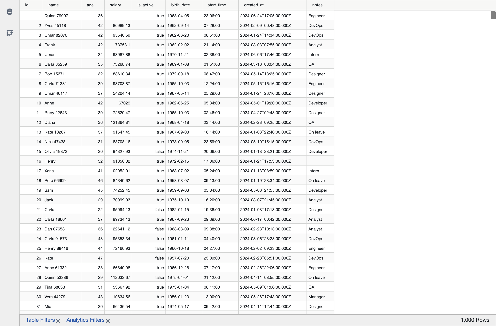
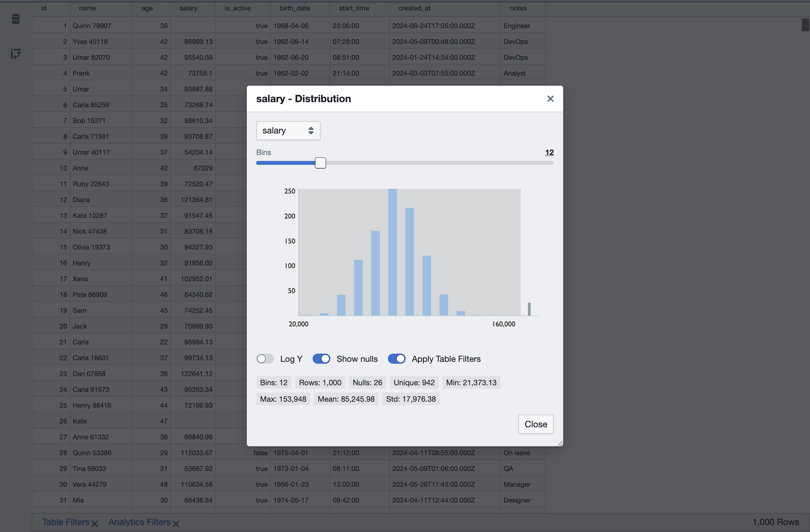
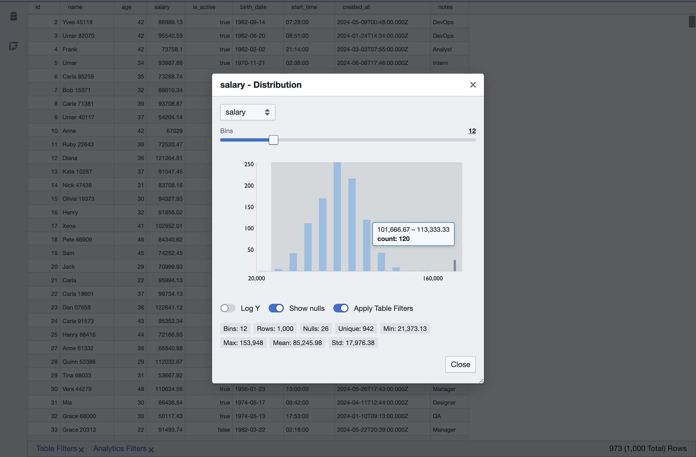
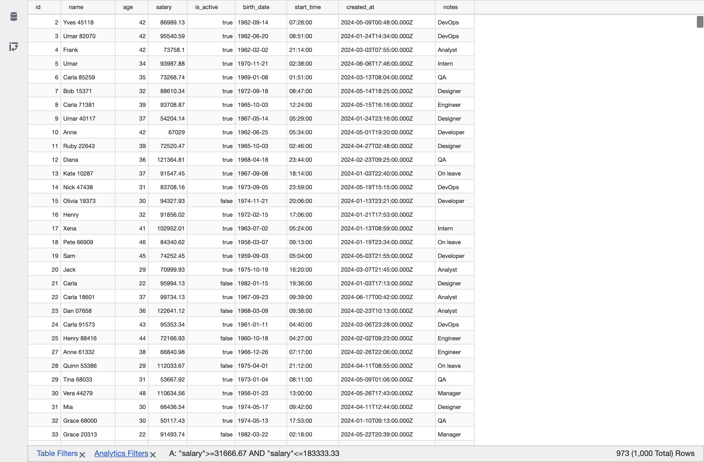
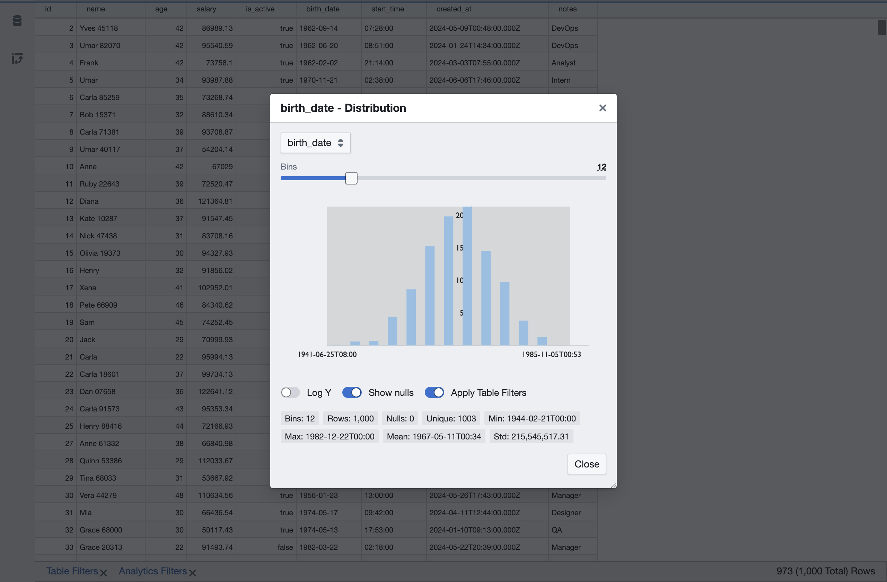
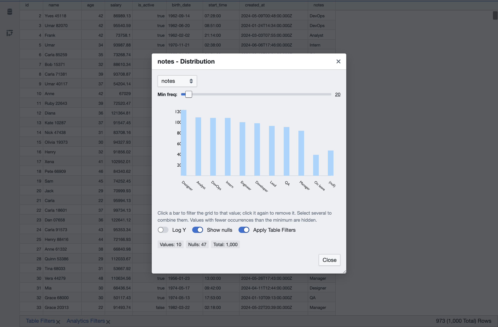
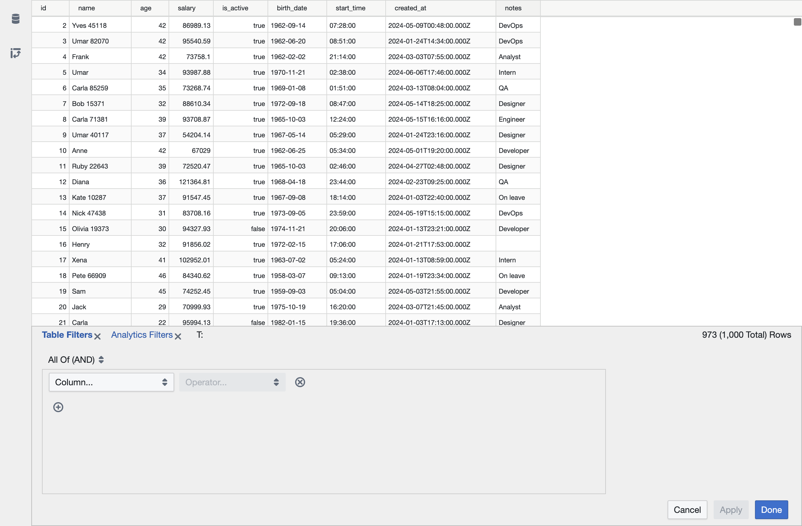
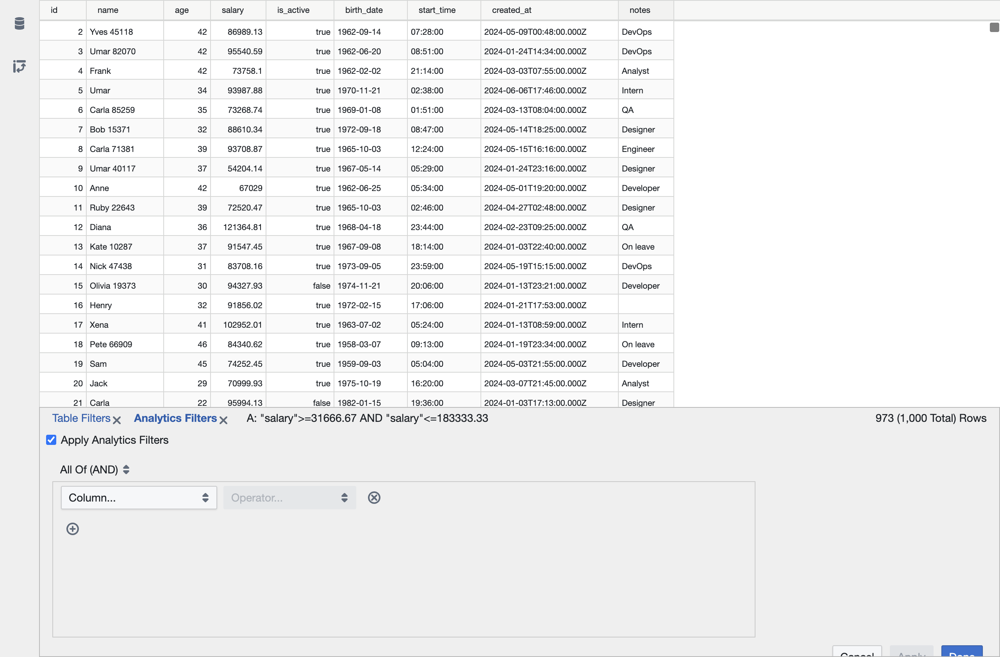

# Data Exploration with MTad

This guide walks through the interactive data-exploration features MTad adds on top of the classic Tad pivot-table viewer: the **Distribution dialog**, the **Scatter Plot Matrix (SPLOM)** and **Scatter Plot** views, and the split **Table / Analytics filters**. The examples use the included [`examples/histogram_test.csv`](../examples/histogram_test.csv) (1,000 rows with numeric, categorical and temporal columns).

## Opening a Distribution

Right-click any column header and choose **Distribution**, or use the **Analytics ▸ Distribution** application menu (opens the dialog for the first chartable column). The dialog is titled with the column name and chart kind, e.g. `salary - Distribution`.

## Numeric columns: binned histogram

Numeric columns are rendered as a binned histogram with a statistics panel:

- **Bins** — a slider from 2 to 50; the value updates live while dragging. Double-click the value to type an exact count (Enter/blur commits, Esc cancels).
- **Log Y** — switch to a logarithmic vertical scale, handy for skewed distributions.
- **Show nulls** — include or hide the null-count bar.
- **Stats** — bins, rows, nulls, unique, min, max, mean and std of the column.

## Brush to filter

Drag across the bars to select a numeric range. Releasing the pointer applies an **analytics filter** (`column >= min AND column <= max`) that immediately filters the grid, with the matching bars highlighted. The filter is announced in the footer behind the dialog as `A: "salary">=31666.67 AND "salary"<=183333.33`, next to the updated row count.

## Temporal columns

`date`, `time` and `timestamp` columns are binned over their epoch-second values, then labeled with type-aware formatting so the axis ticks, hover tooltips and min/max/mean stats read naturally (`1963-07-02`, `05:24`, ...). Brushing works the same way.

## Categorical columns

Non-numeric columns render as a bar chart of the most frequent values (top 20):

- **Min freq** — slider (0–50% of the row count) sets the count threshold below which values are hidden; useful for isolating the dominant categories.
- **Click a bar** to toggle a selection: the grid filters to the selected values (the `(null)` bar filters to `IS NULL`). Selected bars are highlighted in a contrasting color.
- With every bar below the threshold the controls stay visible above the "No values above the selected minimum frequency" message, so you can always lower it.

## Scatter Plot Matrix (SPLOM)

The **Analytics ▸ Scatter Plot Matrix** menu opens an N×N matrix over a selection of columns. Pick up to 10 columns with the searchable multi-select (numeric, temporal **and** categorical columns are allowed), and optionally **color by** a categorical column.

- Each **off-diagonal cell** shows the scatter for that column pair; numeric pairs are annotated with the Pearson correlation (`r = …`), and the cell background of the upper triangle is tinted by it (blue positive, red negative, gray near zero).
- **Diagonal cells** show a mini distribution of the column; clicking one opens the **Distribution** dialog for it.
- **Click an off-diagonal scatterplot** to open that X/Y pair in the standalone **Scatter Plot** dialog (mirroring how a diagonal opens a Distribution). The SPLOM stays open underneath, so closing the Scatter Plot returns to the matrix.
- The result of any brush becomes an **analytics filter** (see below).

## Scatter Plot

A single X/Y pair plotted as a 2D scatter, opened from **Analytics ▸ Scatter Plot** or by clicking an off-diagonal SPLOM cell. Choose the **X**, **Y** and optional **Color by** columns; numeric, temporal and categorical columns can be placed on either axis.

- **2D brush** — drag a rectangle over the plot to filter the grid on both axes (an analytics filter); a click without dragging clears it.
- **Categorical axes** are slot-encoded: each distinct category is an integer band labeled with the category name, so any column can be plotted against any other. Brushing a categorical axis filters to the brushed categories (an `IN` row in the Analytics Filters editor).
- **log X / log Y** toggles for strongly skewed numeric/temporal axes (hidden for categorical axes).
- The **linear regression** trend line (slope/intercept via `regr_slope`/`regr_intercept`) and a stats row (`n`, `r`, `r²`, the fitted line, per-axis ranges). Regression is n/a when either axis is categorical.
- **Sampling** (default 5 000, adjustable up to 20 000) bounds the points; **Use all rows** disables sampling. **Apply Table Filters** (default on) computes the plot over the table-filtered subset.

## Table vs Analytics Filters

The footer separates the view's filter from exploratory filters, in two strictly-separated tabs with their own editors:

- **Table Filters**, persisted with the view and filled **only** through the footer's `table-filter-editor` form (never by any View selection).
- **Analytics Filters**, either filled manually through the footer's `analytics-filter-editor` form or by interaction within analytics views — brushing a Distribution, SPLOM or Scatter Plot, or clicking categorical bars. Every View selection funnels through a single shared entry point (`setAnalyticsClauses`) that **appends** the new criteria (an `AND` of all clauses), replacing only the clauses for the columns being re-selected while preserving criteria from other Views. Analytics filters act on top of the table filter (`(table_filter) AND (analytics_filter)`) whenever the **Apply Analytics Filters** checkbox is ticked.

Each tab shows a live SQL summary of its filter. Hovering a tab, or editing a filter, prefixes the summary with `T: ` or `A: `; the ✕ icon next to each tab clears that filter.

## Additional switches

- **Analytics Filters ▸ Apply Analytics Filters** — master on/off for the exploratory filter when rendering the view.
- **Distribution ▸ Apply Table Filters** (default on) — compute the chart over the table-filtered subset, so exploration always targets the data you are looking at; on pivoted views the chart follows the aggregated view query.

## Under the hood

- Histograms are computed in the database: `width_bucket` over auto-computed "nice" bin edges (or a Sturges-based default when no bin count is given).
- Temporal histograms bin `DATE_PART('epoch', col)` and derive summary stats from the same epoch conversion.
- Category frequencies come from a `GROUP BY ... ORDER BY COUNT(*) DESC LIMIT 20` query.
- Brush filters stay on the raw column with typed literals (`salary >= 31666.67 AND salary <= 183333.33`, `birth_date BETWEEN '2024-01-15' AND '2024-02-19'`), so they survive editing and DuckDB casts them implicitly.